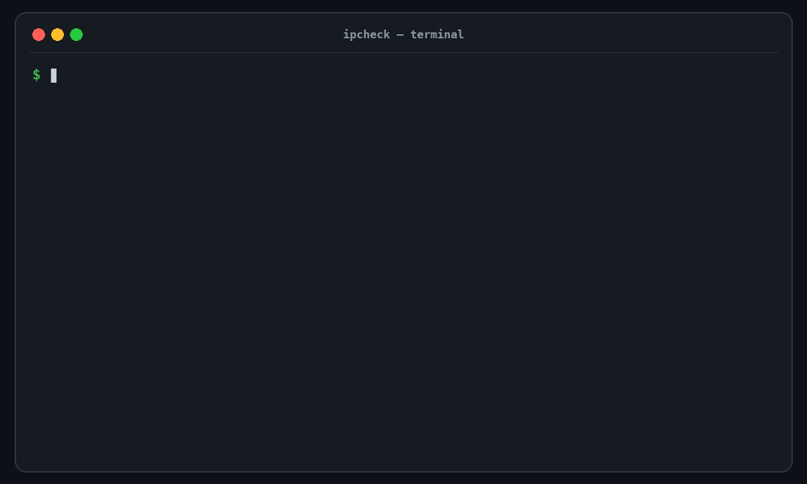

# ipcheck

[](https://github.com/jacklv-coder/ipcheck/actions/workflows/test.yml)
[](https://github.com/jacklv-coder/ipcheck/releases)
[](LICENSE)

[简体中文](README.zh-CN.md)

Know whether **Codex** or **Claude Code** is slow, blocked, or using the wrong
proxy before it breaks your coding flow.

`ipcheck` is a zero-dependency Bash CLI that tests the real service routes used
by AI coding clients. It reports reachability, median/P95 time to first byte,
jitter, capped proxy-path transfer samples, and a plain-language readiness score.
No Codex or Claude login is required. It never reads API keys, sends prompts,
or makes billable model requests.



## Quick start

```bash
brew install jacklv-coder/tap/ipcheck
ipcheck
```

Already installed?

```bash
brew upgrade ipcheck
```

<details>
<summary>Install without Homebrew</summary>

```bash
mkdir -p "$HOME/.local/bin"
curl -fsSL https://raw.githubusercontent.com/jacklv-coder/ipcheck/v0.10.0/bin/ipcheck \
  -o "$HOME/.local/bin/ipcheck"
chmod +x "$HOME/.local/bin/ipcheck"
```

Make sure `$HOME/.local/bin` is on `PATH`.

</details>

## Why not just use Speedtest?

| Tool | What it tells you |
| --- | --- |
| Speedtest | Peak bandwidth to a nearby test server |
| `ping` / `curl` | Basic reachability to one address |
| `ipcheck` | Codex/Claude routes, proxy path, TTFB, P95, jitter, failures, capped reference transfers, and coding readiness |

For coding agents, a 500 Mbps connection can still feel slow when the first byte
takes five seconds or the proxy route is unstable. `ipcheck` measures those
interactive bottlenecks directly.

## What makes it useful

- Tests each detected client separately, so one healthy route cannot hide a
  broken one.
- Understands OpenAI, Anthropic, LiteLLM-style gateways, and Alibaba Cloud
  Model Studio/DashScope Anthropic-compatible routes.
- Explains whether the main problem is reachability, TTFB, P95, jitter, or a
  low Cloudflare reference-transfer sample.
- Produces human, Markdown, and stable versioned JSON reports.
- Shows animated progress, adapts to narrow terminals, and exits cleanly with
  status `130` when cancelled with `Ctrl+C`.

## Supported clients and routes

| Client | Configuration detected | Route tested |
| --- | --- | --- |
| Codex | `$CODEX_HOME/config.toml`, login mode, `model`, `openai_base_url`, custom provider | ChatGPT Codex or OpenAI `/responses`, matching the detected login when possible |
| Claude Code | `settings.json`, `ANTHROPIC_BASE_URL`, `ANTHROPIC_MODEL` | Configured `${ANTHROPIC_BASE_URL}/v1/messages` |
| Custom | `--endpoint`, `IPCHECK_ENDPOINTS` | User-provided HTTP/HTTPS endpoint |

Direct OpenAI/ChatGPT, Anthropic, and compatible gateway routes are auto-probed.
Provider-native routes need an explicit credential-free endpoint: use
`CODEX_NETWORK_ENDPOINTS` for Codex on Bedrock, or `CLAUDE_NETWORK_ENDPOINTS`
for Claude Code provider-native protocols such as Bedrock, Vertex AI, Foundry,
or Mantle. `ipcheck` warns instead of silently testing the wrong provider.

## Common commands

| Command | Purpose |
| --- | --- |
| `ipcheck` | Auto-detect installed clients and run the standard check |
| `ipcheck --quick` | One sample, shorter timeout, no reference transfer |
| `ipcheck codex` / `ipcheck claude` | Test only one client |
| `ipcheck all` | Test Codex and Claude Code together |
| `ipcheck --explain-score` | Show every score component |
| `ipcheck --json` | Emit structured output for automation |
| `ipcheck --markdown` | Create a shareable support report |
| `ipcheck --system` | Add macOS `networkQuality` measurements |
| `ipcheck --no-bandwidth` | Skip capped Cloudflare reference transfers |

Run `ipcheck --help` for every option and environment variable.

## Reading the result

| Result | Meaning |
| --- | --- |
| `GOOD` | Reachable with comfortable first-byte latency and stability |
| `FAIR` | Usable, but delayed, intermittent, rate-limited, or temporarily unhealthy |
| `POOR` | Very slow, unstable, mostly unavailable, or using an invalid API route |
| `BLOCKED` | No service response, or the proxy rejected the request first |
| `UNAVAILABLE` | A provider-specific route was not measured without an explicit safe endpoint |

HTTP `401` and `403` count as reachable because DNS, proxying, TLS, and HTTP
reached the API route. HTTP `407` means the proxy blocked the request.

TTFB is measured from a credential-free protocol request. It reflects DNS,
proxy, TLS, network, and gateway ingress—not authenticated model generation or
time to the model's first token.

The Cloudflare samples describe small transfers from the current proxy/network
path to Cloudflare. They are not peak-bandwidth tests and do not represent
OpenAI, Anthropic, GitHub, or npm throughput.

The 0–100 score is a transparent rule, not a user percentile. AI interaction
contributes 80 points and engineering transfer contributes 20. Repeated
constrained transfer samples can also cap an otherwise high score. See
[Scoring and result rules](docs/scoring.md) for the exact calculation.

## Claude Code gateway example

This configuration is auto-detected:

```json
{
  "env": {
    "ANTHROPIC_AUTH_TOKEN": "YOUR_API_KEY",
    "ANTHROPIC_BASE_URL": "https://dashscope.aliyuncs.com/apps/anthropic",
    "ANTHROPIC_MODEL": "deepseek-v4-flash"
  }
}
```

`ipcheck claude` safely probes the corresponding `/v1/messages` route without
reading or sending `ANTHROPIC_AUTH_TOKEN`.

## Privacy by design

- Authentication values never enter shell variables or temporary files.
- API keys, bearer tokens, cookies, and prompts are never sent to curl.
- Proxy credentials are redacted; unsafe endpoint URLs are rejected.
- Every curl invocation ignores user `.curlrc` files.
- Temporary metrics are removed on normal exit and cancellation.

See [SECURITY.md](SECURITY.md) for private vulnerability reporting.

## Documentation

- [Scoring and result rules](docs/scoring.md)
- [Routes, proxies, and reference transfers](docs/network.md)
- [Reports, automation, and exit codes](docs/reporting.md)
- [Release history](CHANGELOG.md)

## Requirements

- macOS or Linux
- Bash 3.2+
- curl, awk, sed, sort
- Optional on macOS: `networkQuality`

## Contributing

Issues and pull requests are welcome. Start with
[CONTRIBUTING.md](CONTRIBUTING.md) and the
[Code of Conduct](CODE_OF_CONDUCT.md).

## License

MIT
