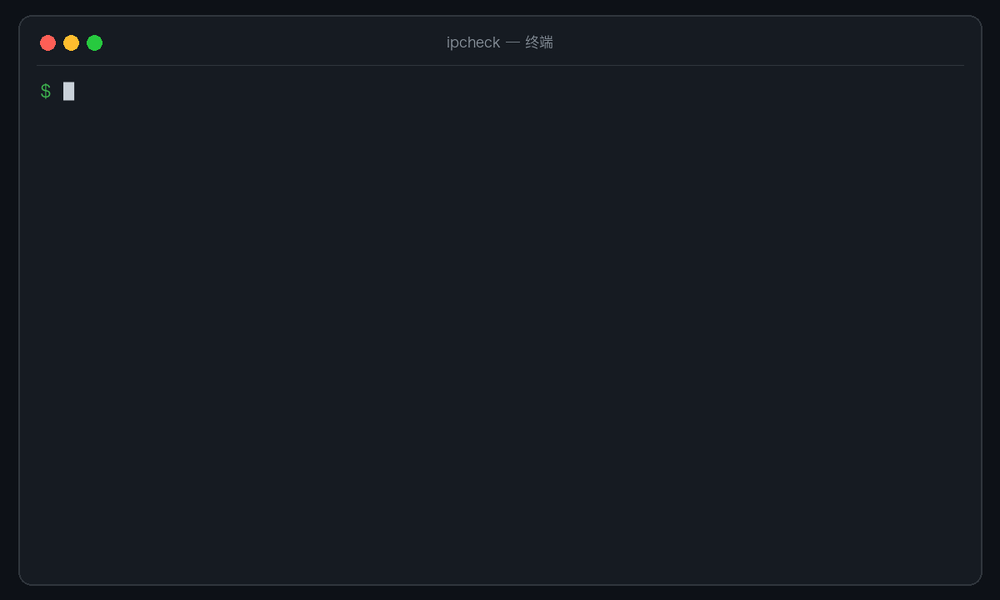

# ipcheck

[](https://github.com/jacklv-coder/ipcheck/actions/workflows/test.yml)
[](https://github.com/jacklv-coder/ipcheck/releases)
[](LICENSE)

[English](README.md)

在代理或网络打断编码节奏之前，判断 **Codex**、**Claude Code** 到底是慢、
被阻断，还是走错了链路。

`ipcheck` 是一个零依赖 Bash CLI，检测 AI 编程客户端实际使用的服务路径，
提供可达性、TTFB 中位数/P95、抖动、限量代理链路传输样本和直白的开发适配分。
无需登录 Codex 或 Claude；它不会读取 API Key、发送 Prompt，也不会产生
模型调用费用。



## 快速开始

```bash
brew install jacklv-coder/tap/ipcheck
ipcheck
```

已经安装过：

```bash
brew upgrade ipcheck
```

<details>
<summary>不使用 Homebrew 安装</summary>

```bash
mkdir -p "$HOME/.local/bin"
curl -fsSL https://raw.githubusercontent.com/jacklv-coder/ipcheck/v0.10.0/bin/ipcheck \
  -o "$HOME/.local/bin/ipcheck"
chmod +x "$HOME/.local/bin/ipcheck"
```

请确认 `$HOME/.local/bin` 已加入 `PATH`。

</details>

## 为什么不只用 Speedtest？

| 工具 | 能告诉你什么 |
| --- | --- |
| Speedtest | 到附近测速服务器的峰值带宽 |
| `ping` / `curl` | 单个地址的基础连通性 |
| `ipcheck` | Codex/Claude 实际路径、代理、TTFB、P95、抖动、失败率、限量参考传输和开发适配分 |

即使带宽达到 500 Mbps，只要首字节需要五秒或代理链路不稳定，AI 编程体验
仍然会很慢。`ipcheck` 直接测量这些影响交互节奏的瓶颈。

## 核心价值

- 分别检测每个客户端，避免一条健康链路掩盖另一条异常链路。
- 兼容 OpenAI、Anthropic、LiteLLM 类网关，以及阿里云百炼/DashScope
  Anthropic 兼容入口。
- 直接指出主要问题来自可达性、TTFB、P95、抖动，还是 Cloudflare 参考传输
  样本偏低。
- 支持终端、Markdown 和稳定的版本化 JSON 报告。
- 提供动态进度、窄终端适配，并能通过 `Ctrl+C` 干净退出，返回状态码 `130`。

## 支持的客户端与路径

| 客户端 | 自动识别的配置 | 检测路径 |
| --- | --- | --- |
| Codex | `$CODEX_HOME/config.toml`、登录方式、`model`、`openai_base_url`、自定义 provider | 尽可能按登录方式选择 ChatGPT Codex 或 OpenAI `/responses` |
| Claude Code | `settings.json`、`ANTHROPIC_BASE_URL`、`ANTHROPIC_MODEL` | `${ANTHROPIC_BASE_URL}/v1/messages` |
| 自定义 | `--endpoint`、`IPCHECK_ENDPOINTS` | 用户指定的 HTTP/HTTPS 地址 |

OpenAI/ChatGPT、Anthropic 直连与兼容网关会自动探测。provider 原生路径需要
明确提供无凭据检测地址：Codex on Bedrock 使用 `CODEX_NETWORK_ENDPOINTS`；
Claude Code 的 Bedrock、Vertex AI、Foundry、Mantle 等 provider 原生协议使用
`CLAUDE_NETWORK_ENDPOINTS`。`ipcheck` 会给出警告，而不是静默检测错误的 provider。

## 常用命令

| 命令 | 用途 |
| --- | --- |
| `ipcheck` | 自动识别客户端并执行标准检测 |
| `ipcheck --quick` | 单次采样、缩短超时、不运行参考传输 |
| `ipcheck codex` / `ipcheck claude` | 只检测一个客户端 |
| `ipcheck all` | 同时检测 Codex 和 Claude Code |
| `ipcheck --explain-score` | 展开全部评分依据 |
| `ipcheck --json` | 输出供自动化使用的结构化数据 |
| `ipcheck --markdown` | 生成可分享的支持报告 |
| `ipcheck --system` | 增加 macOS `networkQuality` 数据 |
| `ipcheck --no-bandwidth` | 跳过限量 Cloudflare 参考传输 |

运行 `ipcheck --help` 可以查看全部选项和环境变量。

## 如何理解结论

| 结果 | 含义 |
| --- | --- |
| `GOOD` | 链路可达，首字节延迟和稳定性处于舒适范围 |
| `FAIR` | 可以使用，但有延迟、波动、限流或临时服务异常 |
| `POOR` | 非常慢、不稳定、多数不可用，或 API 路径配置错误 |
| `BLOCKED` | 没有服务响应，或请求先被代理拒绝 |
| `UNAVAILABLE` | provider 专用路径因缺少明确的安全检测地址而未被测量 |

HTTP `401` 和 `403` 代表链路可达，因为 DNS、代理、TLS 和 HTTP 已经到达
API 路径；HTTP `407` 表示请求被代理拦截。

TTFB 来自无凭据协议请求，反映 DNS、代理、TLS、网络与网关入口耗时；它不
包含认证后的模型生成时间，也不是模型首个 Token 的到达时间。

Cloudflare 样本反映的是当前代理/网络到 Cloudflare 的小文件传输表现，不是
峰值宽带测速，也不代表 OpenAI、Anthropic、GitHub 或 npm 的吞吐。

0–100 分是透明的规则评分，不代表用户百分位。AI 交互占 80 分，工程传输占
20 分；重复出现明显受限的传输样本还会限制原本较高的总分。精确计算方式见
[评分与结论规则](docs/scoring.zh-CN.md)。

## Claude Code 网关示例

下面的配置会被自动识别：

```json
{
  "env": {
    "ANTHROPIC_AUTH_TOKEN": "YOUR_API_KEY",
    "ANTHROPIC_BASE_URL": "https://dashscope.aliyuncs.com/apps/anthropic",
    "ANTHROPIC_MODEL": "deepseek-v4-flash"
  }
}
```

`ipcheck claude` 会安全检测对应的 `/v1/messages`，不会读取或发送
`ANTHROPIC_AUTH_TOKEN`。

## 隐私设计

- 认证值不会进入 Shell 变量或临时文件。
- 不会向 curl 发送 API Key、Bearer Token、Cookie 或 Prompt。
- 代理凭据会被脱敏，不安全的端点 URL 会被拒绝。
- 每次 curl 调用都会忽略用户的 `.curlrc`。
- 正常退出或取消时都会删除临时指标。

安全问题请按照 [SECURITY.md](SECURITY.md) 私下报告。

## 详细文档

- [评分与结论规则](docs/scoring.zh-CN.md)
- [服务路径、代理与参考传输](docs/network.zh-CN.md)
- [报告、自动化与退出码](docs/reporting.zh-CN.md)
- [版本历史](CHANGELOG.md)

## 运行要求

- macOS 或 Linux
- Bash 3.2+
- curl、awk、sed、sort
- macOS 可选：`networkQuality`

## 参与贡献

欢迎提交 Issue 和 Pull Request。请先阅读
[CONTRIBUTING.md](CONTRIBUTING.md) 和
[CODE_OF_CONDUCT.md](CODE_OF_CONDUCT.md)。

## 许可证

MIT
